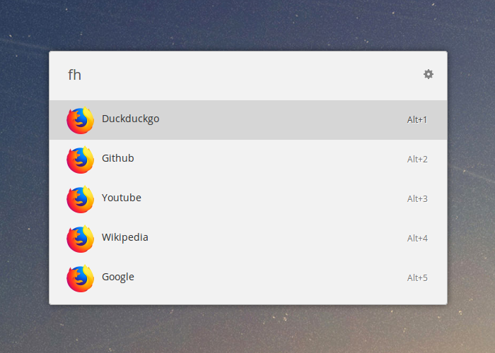

# Ulauncher Firefox History

### [Ulauncher](https://ulauncher.io) extension for quickly accessing already visited websites.

## Use
> fh 

List the five most popular websites in Firefox history.

> fh query

List the five most popular websites in Firefox history that matches the query

## Settings

The search results can be **aggregated by hostname**, so that visiting _twitter.com/UlauncherApp_ and _twitter.com/github_ generates _twitter.com_ as result.

The **number of results** and the **popularity criteria** can be changed in the extension's settings. The popularity can be determined by last visit date, visit count or [Firefox Frecency](https://developer.mozilla.org/en-US/docs/Mozilla/Tech/Places/Frecency_algorithm) heuristic.

## Install
> https://github.com/rmassidda/ulauncher-firefox-history

Copy and paste this repository link inside __Add extension__ in Ulauncher's settings panel.
