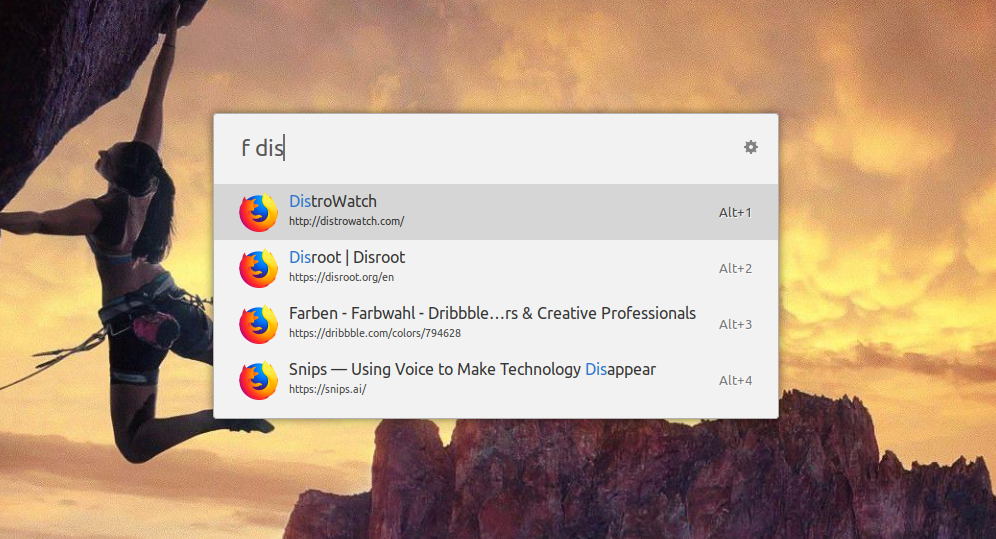

# Ulauncher Firefox Bookmarks

### [Ulauncher](https://ulauncher.io) extension for quickly accessing bookmarked pages in Firefox.

## Use
> f query

List the best matched bookmarks from Firefox sorted by first occurence of the search string.

## Settings
The **number of results** can be changed in the extension's settings.

## Install
> https://github.com/kuenzelit/ulauncher-firefox-bookmarks

Copy and paste this repository link inside __Add extension__ in Ulauncher's settings panel.

## Thanks to
Thanks go to Riccardo Massidda since his extension [ulauncher-firefox-history](https://github.com/rmassidda/ulauncher-firefox-history) was the base for this extension and was adjusted to be used with bookmarks.
